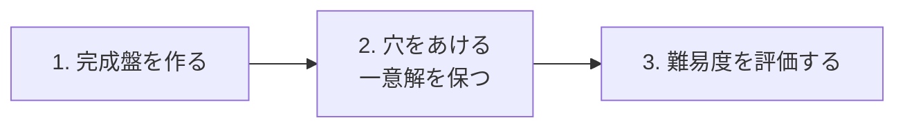
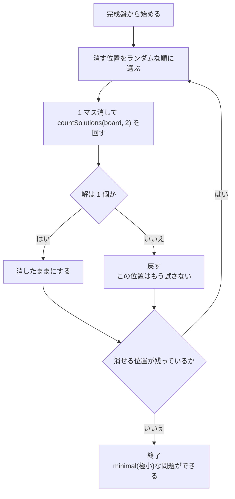
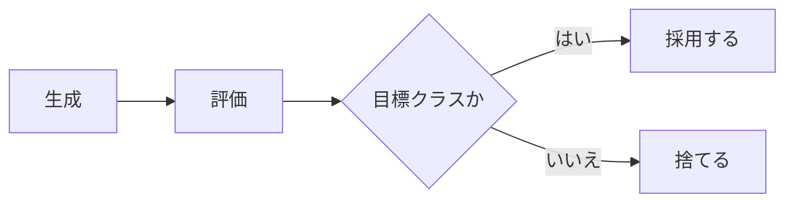

# 盤面の生成

問題を作る工程は 3 段である。



3 は [難易度の評価](difficulty-rating.md)。この文書は 1 と 2 を扱う。
根拠は [数独の生成・難易度評価・ファイル形式の調査](../reports/2026-08-05-sudoku-generation-survey.md)。

## 大前提: 乱数は外から注入する

```ts
generatePuzzle(rng: () => number, options)
```

**`core` は乱数を内部で作らない。** シード付きの疑似乱数を呼び出し側が渡す。

**理由は 2 つ。**

- **同じシードから同じ問題ができる。** [ADR 0003](../decisions/0003-external-puzzle-files.md) は
  「管理外のパックはシードから作り直せる」ことに依存している
- **テストが書ける。** 生成はランダムなので、シードを固定できないと再現できない

**`Math.random()` を `core` の中で呼んだ時点でこの設計は壊れる。**

**シードから乱数を作る道具は `core` にある**(`packages/core/src/random.ts` の `createRandom`)。
生成側と遊技側で別々の疑似乱数を持たないためである。
**これも `Math.random()` を呼ばない**ので、シードさえ同じなら
ブラウザでも Node でも同じ列が出る。

## 1. 完成盤を作る

### ⚠️ 同型変換で量産してはいけない

1 つの完成盤から、数独の妥当性を保つ変換(数字の置換・バンド内の行入替・
バンド同士の入替・転置)を合成すると **1,218,998,108,160 個の同型盤**ができる。

**だが同型盤は「見た目が違うだけの同じパズル」である。**
論理構造が同じなので**難易度も解き筋も完全に同一**になる。

**⇒ 完成盤は毎回バックトラッキングで作る。** 変換で水増ししない。

⚠️ **90°/180°/270° の回転と鏡映は独立の変換ではない**(転置とバンド/スタック入替の合成に
含まれる)。「回転も足せば種類が増える」は誤りである。

同型変換を使ってよいのは**「同じ問題を見た目だけ変えて再出題する」** 用途だけ。
本プロジェクトでは現時点で使わない。

### 作り方

**実装は `packages/core/src/generate.ts` の `generateSolvedBoard`。**

ランダム化バックトラッキング。ただし 2 つの最適化を入れる。

1. **上段バンド(1〜3 行)と第 1 列は、バックトラッキング無しで先に埋められる。**
   **探索対象が 81 マスから 48 マスへ減る**
2. **候補数が最小の空きマスを優先する。** 分岐の幅が最小になる

本質的に異なる完成盤は 5,472,730,538 通りあるので、**枯渇の心配は無い**。

**実測: 1 個あたり 105 μs(毎秒 約 9,500 個)。**
上段バンドと第 1 列の埋め方は**10,000 個の生成で 1 度もやり直しが起きなかった**
([検証](../reports/2026-08-05-puzzle-generation-benchmark.md))。

## 2. 穴をあける

### 手順

**実装は `packages/core/src/generate.ts` の `digHoles`。**



**一意解の判定は [探索ソルバ](solver.md) の `countSolutions` に任せる。**
生成側で解の数え方を自作しない。

### 対称性を持たせるか

**既定は「持たせない」。** 見た目の美しさのために手がかりの配置を点対称にする流儀があるが、
**対称性を課すと消せる位置が減り、難易度の上限が下がる**。

対称にしたい場合は**ペアで消してペアで戻す**(片方だけ消すと対称が崩れる)。
これは工程 4 以降の検討事項とする。

### ⚠️ 手がかりを減らしても難しくならない

- 一意解を持つ最小の手がかり数は **17**(2012 年に網羅探索で証明済み)。
  既知の 17 手がかり問題は 49,158 件しかない
- 一様ランダムに極小問題を取ると **24〜25 手がかり付近が圧倒的多数**を占め、
  **17 手がかり級は極端に稀**
- そもそも**手がかり数と人間の体感難易度の相関は 0.25〜0.27** しかない

**⇒ 難易度を狙うなら手がかり数ではなく [難易度の評価](difficulty-rating.md) を回す。**
「難しい問題が欲しいから手がかりを 22 個にする」という作り方はしない。

**実装の分布も同じ形になった。** 1,000 問の実測で最小 21・中央 24・平均 24.37・最大 29、
**17 手がかりは 1 問も出ていない**([検証](../reports/2026-08-05-puzzle-generation-benchmark.md))。

### 目標難易度に寄せる方法

**穴あけの段階で難易度は狙えない。** 評価は穴あけが終わってからしかできない。

したがって次の流れになる。



**捨てる前提で数を回す。** これが「大量生成」を要件にできる理由でもある。
どのクラスがどれくらいの割合で出るかは**工程 2 で実測する**(分布を記録する)。

**やさしい問題では、`easy` と判定されたことを出発点にする。**
そのうえで、候補メモを使わなくても次の一手を追いやすい問題を優先し、
「メモが無いと進めない」問題をやさしい問題として積極的に残さない。
これは収録候補の質を上げるための目標であり、**手がかり数・固定スコア・再生成回数で
判定する実装方式はここでは決めない**。確認方法と採用基準は実装側で定め、
パックを更新したときは分布と到達点を実測して記録する。

## 3. 並列化

**実装は `packages/generator/src/pool.ts`。**

**1 問ごとに完全に独立している**ので、並列化は素直に効く。
**実測で 8 並列 4.64 倍**([検証](../reports/2026-08-05-puzzle-generation-benchmark.md))。

- `generator` が **`worker_threads`** でワーカーを立てる
- **試行に通し番号を振り、番号からシードを決める**(`<パックのシード>#<番号>`)。
  ワーカーへ別々のシードを配るのではない
- 採用した問題を**試行番号の昇順**に並べてから必要数だけ取る
- パックへ書くときは**難易度クラスとスコアの昇順**に並べ替える
  (**書き込み順を到着順にすると出力が非決定的になる**)

🎯 **この作りだと並列度を変えても出力が 1 バイトも変わらない。**
ワーカー 8 と 3 で生成した `puzzles/` が完全一致することを実測済み。
**「ワーカーごとに別のシード」にすると、並列度を変えた瞬間に中身が変わってしまう。**

## 性能

**実測した**([検証: 問題の生成](../reports/2026-08-05-puzzle-generation-benchmark.md)。
Apple M1 Ultra / Node 24 / 単スレッド)。

| 段 | 値 |
|----|-----|
| 完成盤の生成 | 1 個あたり 105 μs |
| 完成盤 + 穴あけ | **1 問あたり 1.56 ms(毎秒 約 640 問)** |

**穴あけが全体の約 93% を占める。** 1 マス消すごとに一意解を判定するためである。
パック 1 個(1,000 問)なら約 1.6 秒で作れる。

参考にした公開値(いずれも C++ / Java の実装で、**難易度評価を含む**)。

| 実装 | 値 |
|------|-----|
| QQwing(標準版) | 1,000 問の生成に 25 秒(= 40 問/秒) |
| QQwing(Java 版) | 毎秒 1,000 問 |
| ある局所探索の実装 | 1 問あたり平均 596 ms(1.66 GHz の低速 CPU・200 反復) |

⚠️ **同じ出典に「JavaScript 版は非常に遅い」と明記されていたが、実測はその警告ほど遅くなかった。**

⚠️ **上の実測に難易度評価は入っていない。** 目標クラスに外れた問題を捨てる分だけ
実効の生成速度は落ちる。**工程 2 の 5 の後に測り直す。**

## テスト

[テストの方針](../verification/testing-policy.md) の「必ず守る性質」のうち、
生成が直接支えるのは次の 3 つ。

| 性質 | 検証 |
|------|------|
| 生成した問題は一意解である | 生成直後に `countSolutions === 1` |
| 手がかりを 1 つ戻すと複数解になる(極小性) | 各手がかりを 1 つずつ戻して確認 |
| 同じシードからは同じ問題ができる | 2 回生成してバイト単位で一致 |

## 関連ドキュメント

- [解法(ソルバ)](solver.md) — 一意解の判定
- [難易度の評価](difficulty-rating.md) — 生成した問題を分類する
- [問題ファイルの形式](../api/puzzle-file-format.md) — 生成結果の置き場所
- [調査: 数独の生成・難易度評価・ファイル形式](../reports/2026-08-05-sudoku-generation-survey.md)
