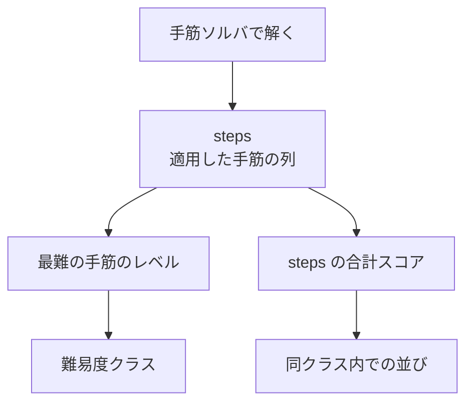

# 難易度の評価

**難易度は「解くのに必要な手筋の難しさ」で決める。**
根拠は [数独の生成・難易度評価・ファイル形式の調査](../reports/2026-08-05-sudoku-generation-survey.md)。

## 🎯 手がかり数で難易度を決めてはいけない

**これがこの文書で最も重要な事実である。**

人間の解答時間との相関係数(1,700 問超・数百人のデータによる評価)。

| 指標 | 相関 |
|------|------|
| **手がかり数** | **0.25 / 0.27** |
| 依存構造(Dependency) | 0.67 / 0.69 |
| Sudoku Explainer のレーティング | 0.70 / 0.86 |
| 複合指標(Combined SFRD) | 0.84 / 0.95 |

**手がかり数はほぼ役に立たない。** 「28 個だから難しい」は成り立たない。

難易度の源は **①個々の手筋の難しさ**と**②手筋どうしの依存構造**の 2 つである。

## 採用する方式

**実装は `packages/core/src/difficulty.ts`(手筋ソルバは `technique-solver.ts`)。**

**「解くのに必要だった最難の手筋」でクラスを決め、補助的に手数を見る。**

**既存の 2 方式を折衷している。**

- **Sudoku Explainer 方式** —— 最も難しい手筋のレーティングがパズルのレーティング(1.0〜12.7)
- **HoDoKu 方式** —— 全ステップのスコアを合計。ただし
  **パズルのレベルは最難ステップのレベルを下回らない**

**⇒ クラスは最難手筋で決める(下回らせない)。合計スコアはクラス内の順序付けに使う。**

## 手筋のレベル

**[解法(ソルバ)](solver.md) の「手筋の適用順」と同じ並びである。**
順序を変えると難易度が変わるので、**両方の文書を同時に直す**こと。

| レベル | 手筋 | 目安 |
|--------|------|------|
| 1 | Naked Single / Hidden Single | 候補メモ無しで解ける |
| 2 | Locked Candidates(Pointing / Claiming) | 候補メモがあると楽 |
| 3 | Naked / Hidden Pair | 候補メモが要る |
| 4 | Naked / Hidden Triple・Quad | |
| 5 | X-Wing / Swordfish / Jellyfish | 盤面をまたぐ |
| 6 | XY-Wing / XYZ-Wing | |
| 7 | チェーン系(**X-Chain** は実装済み / Forcing Chain は未実装) | 仮定を伸ばす |

参考にした Sudoku Explainer のレーティングでは、
Naked Single = 2.3、Pointing = 2.6、X-Wing = 3.2、XY-Wing = 4.2、
Forcing Chains = 7.1〜7.5、Dynamic Forcing Chains = 8.8 以上、と付いている。

### 手筋のスコア(実装値)

**同じクラスの中で問題を並べるためだけに使う。**

| 手筋 | スコア | 手筋 | スコア |
|------|--------|------|--------|
| Naked Single | 1 | Naked Quad | 20 |
| Hidden Single | 2 | Hidden Quad | 24 |
| Pointing | 5 | X-Wing | 30 |
| Claiming | 5 | Swordfish | 36 |
| Naked Pair | 8 | Jellyfish | 42 |
| Hidden Pair | 10 | XY-Wing | 50 |
| Naked Triple | 14 | XYZ-Wing | 55 |
| Hidden Triple | 16 | X-Chain | 70 |

⚠️ **絶対値に意味は無い。** レベルの並びを崩さないように選んだだけの値であり、
上の Sudoku Explainer のレーティングを持ち込んでいない(下記「採用しなかった方式」)。

⚠️ **スコアでクラスを決めない。** 実測ではクラスごとのスコアの範囲が大きく重なる
(`easy` の最大 90 が `normal` の中央 84 を超える。
[検証](../reports/2026-08-05-difficulty-distribution.md))。

## 難易度クラス

**5 段階とする。** 呼び名は UI にそのまま出す
([画面構成と操作仕様](../ui/screens-and-interactions.md))。

| 表示名(UI) | ファイル上の値 | 解くのに要る最難レベル | 想定 |
|-------------|--------------|---------------------|------|
| やさしい | `easy` | 1 | Single だけで解ける。収録パックは Naked Single のみ |
| ふつう | `normal` | 2 | Locked Candidates まで |
| むずかしい | `hard` | 3〜4 | Pair / Triple が要る |
| 難問 | `expert` | 5〜6 | X-Wing / XY-Wing が要る |
| 最難関 | `extreme` | 7 | チェーンが要る |

**ファイル上の値は英語で固定する**([問題ファイルの形式](../api/puzzle-file-format.md))。
表示名は UI 側で対応付ける。**ファイルに日本語を書かない**(表示を変えたくなったときに
収録済みのパックを全部書き直すことになる)。

**✅ しきい値は 2026-08-05 に確定した**(暫定ではない)。
実測した分布は下表のとおりで、**「ふつうだけが極端に多い」といった偏りは無かった**。

### 実測した分布(2026-08-05・5,000 問・レベル 1〜7 実装後)

| クラス | 割合 | 1 問得るまで |
|--------|------|------------|
| やさしい | **40.3%** | 4.2 ms |
| ふつう | 11.4% | 14.9 ms |
| むずかしい | 6.8% | 25.1 ms |
| 難問 | 5.3% | 32.1 ms |
| 最難関 | 6.1% | 28.1 ms |
| **評価できない** | **30.1%** | — |

**✅ しきい値はこのままで確定した(2026-08-05)。**
5 クラスすべてに問題が行き渡り、どのクラスも 1,000 問のパックを 5 秒以内に作れる。

🎯 **レベル 5〜7 を足しても、やさしい・ふつう・むずかしいの問数は 1 問も動かなかった。**
簡単な手筋から順に試すので、**低いレベルで解ける問題の評価は手筋を足しても変わらない**
([検証](../reports/2026-08-05-difficulty-distribution.md))。

なお、**難易度クラスとしての `easy` はレベル 1 (Naked / Hidden Single) のまま**である。
「候補メモを使わなくても解ける」という要望に対して、収録する easy パックだけは
生成時に手がかりを 40 個以上残し、`Naked Single` だけで解ける問題へ絞っている
([盤面の生成](board-generation.md#やさしいパックだけの追加条件))。

**残る 30.1% は Forcing Chain などが要る問題**で、いまは捨てている。

## 実装していない手筋の扱い

**手筋ソルバが解けない問題は、そのクラスに入れない。**

最初は基本手筋(レベル 1〜4)しか実装しなかった
([解法(ソルバ)](solver.md) の「実装の範囲」)。
その段階では「難問」と「最難関」を作れなかったが、それでよかった。

**2026-08-05 にレベル 5〜7 を足し、5 クラスすべてを作れるようになった。**
「評価できない」は 41.5% → **30.1%** に減り、**568 問(27%)が難問・最難関へ移った**。
残りは Forcing Chain などが要る問題で、**引き続き捨てる**。

- 手筋ソルバで解けなかった問題は **収録しない**(捨てる)
- 実装する手筋を増やすと、上のクラスが作れるようになる

**「解けなかったから最難関」と分類してはいけない。**
それは「難しい」ではなく「評価できていない」である。

## 評価は決定的でなければならない

**同じ問題を 2 回評価したら同じクラスになること**
([テストの方針](../verification/testing-policy.md) の性質 4)。

- 手筋ソルバの走査順に乱数を混ぜない
- 手筋の適用順を固定する(同じ盤面で複数の手筋が使えるとき、必ず簡単な方を選ぶ)

**ここが崩れると、パックのマニフェストに書いた難易度が信用できなくなる。**

## 参考にしたが採用しなかった方式

| 方式 | 採用しない理由 |
|------|--------------|
| SudokuWiki の正規化スコア(`Log5(score) × 2` で 1〜10) | 候補密度の係数に**未検証の疑い**がある(`C / 727` の 727 は 729 の誤りの可能性)。採用するなら原典の確認が要る |
| 探索ベースの分岐スコア(`S = B × 100 + E`) | 実装は軽いが、**人間の体感と手筋ソルバほど噛み合わない**。ヒントにも流用できない |
| 手がかり数による分類 | 上記のとおり相関が 0.25〜0.27 しかない |

⚠️ Sudoku Explainer のクラス区切り(Easy 1.0〜1.2 など)は**フォーラム由来**で、
公式ドキュメントでは未確認。**数値をそのまま持ち込まない。**

## 関連ドキュメント

- [解法(ソルバ)](solver.md) — 手筋ソルバと適用順
- [盤面の生成](board-generation.md) — 目標クラスに外れた問題は捨てる
- [問題ファイルの形式](../api/puzzle-file-format.md) — 難易度はパックとマニフェストに記録する
- [テストの方針](../verification/testing-policy.md) — 分布を毎回記録する
- [調査: 数独の生成・難易度評価・ファイル形式](../reports/2026-08-05-sudoku-generation-survey.md)
