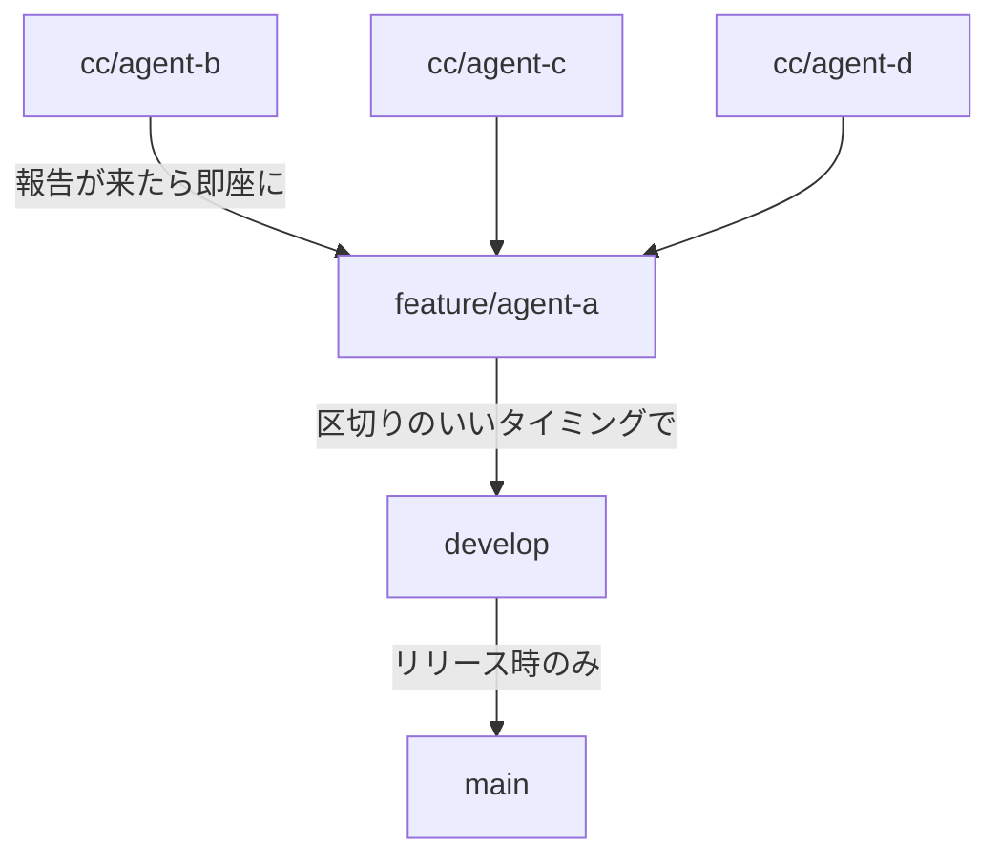

# ブランチ戦略

**ブランチの種類・誰が何をマージできるか・いつ寄せるかを定める。**
担当とブランチの対応は [作業の引き継ぎ](handover.md#3-いまの体制) の体制表にある。
マージの手順は `ops-branch-merge` スキル。

## ブランチの種類

| ブランチ | 役割 | 直接コミット |
|---------|------|------------|
| `main` | リリース済みの状態 | **禁止** |
| `develop` | 統合ブランチ。**動く状態を保つ** | **禁止**(下記) |
| `feature/agent-a` | 管理役の作業 + 全担当の集約先 | **可**(管理役のみ) |
| `cc/agent-<x>` | 作業エージェントの実装ブランチ | **可**(その担当のみ) |

## 流れ

**寄せるのは管理役だけである。**

**2 段で寄せる。** `cc/agent-*` から `develop` へ直接寄せない。

## 禁止事項

### ⚠️ `develop` へ直接コミットしない

**2026-08-05 のユーザー指示。**

`develop` に入ってよいのは **`feature/agent-a` からの no-ff マージだけ**である。
`develop` をチェックアウトして編集・コミットしない。
ホットフィックスであっても `feature/agent-a` を経由する。

**理由**: `develop` へ直接入れた変更は `feature/agent-a` に無いため、
次のマージで**戻ってきた過去の状態と衝突する**。統合の起点を 1 本に保つ。

### ⚠️ 作業エージェントは `develop` を書き換えない

作業エージェント(b / c)は `develop` を **読む(自分のブランチへ取り込む)だけ**。
`develop` をチェックアウトしてのマージ・コミットをしない。

### ⚠️ 他人のブランチを直接書き換えない

### ⚠️ push は指示があるまでしない

[AGENTS.md](../../AGENTS.md) の開発上の約束。

## 誰が何をできるか

| 操作 | agent-a(管理役) | agent-b / agent-c |
|------|----------------|-------------------|
| 自分のブランチへコミット | ✅ `feature/agent-a` へ自由に | ✅ `cc/agent-<x>` へ自由に |
| `cc/agent-*` → `feature/agent-a` のマージ | ✅ **管理役だけ** | ❌ |
| `feature/agent-a` → `develop` のマージ | ✅ **管理役だけ** | ❌ |
| `develop` を自分のブランチへ取り込む | ✅ | ✅ |
| `develop` / `main` へのコミット | ❌ | ❌ |
| push | ユーザーの指示があるときだけ | ❌ |

**`feature/agent-a` へは管理役が自由にコミットしてよい**(2026-08-05 のユーザー許可)。
文書の更新・実測値の反映・工程 1 の実装はここへ直接入れる。

## いつ寄せるか

### `cc/agent-*` → `feature/agent-a`

**区切りの報告が来たら即座に。** 溜めない。

区切りとは「コミット済み・worktree クリーン・管理役への報告を送信済み」の状態
([並列エージェントの運用](parallel-agent-operations.md#進捗の測り方と報告))。

### `feature/agent-a` → `develop`

**区切りのいいタイミングで**(2026-08-05 のユーザー指示)。
細かい文書修正のたびに寄せない。

**「区切りのいいタイミング」の判断基準。** 次を**すべて**満たしたとき。

| # | 条件 |
|---|------|
| 1 | 工程が 1 つ閉じた、または機能が 1 つ動くところまで通った |
| 2 | **テストと型チェックが通っている**(実測すること) |
| 3 | 未統合の `cc/agent-*` が無い、または残していく理由が説明できる |
| 4 | ロードマップと引き継ぎの記述が実態と合っている |

**2 を飛ばさない。** `develop` は動く状態を保つブランチなので、
壊れたものを寄せると全担当が影響を受ける。

## マージのしかた

**`ops-branch-merge` スキルを使う。** 手順の要点は次の 2 つ。

1. **`SRC` → `DST` は必ず `--no-ff`** でマージする(履歴にマージノードを残す)
2. **最後に `SRC` を `DST` へ fast-forward して同一コミットに揃える**

マージだけして作業ブランチが古いまま残る状態で終わらせない。

**競合は勝手に解決しない。** 状況を提示してユーザーの判断を仰ぐ。

## コミットの規約

- **日本語で書く**([AGENTS.md](../../AGENTS.md))
- **関心事ごとに分割する。** 「まとめて 1 コミット」にしない
- 過去のコミットに倣う
- **1 行目は要約、空行、本文。** 本文には「なぜそうしたか」を書く

## worktree との対応

| ブランチ | 作業場所 |
|---------|---------|
| `feature/agent-a` | メインの作業ディレクトリ |
| `cc/agent-b` | `.claude/worktrees/agent-b-*` |
| `cc/agent-c` | `.claude/worktrees/agent-c-*` |

**worktree は Git 管理外**なので、別の端末では作り直す。
同じブランチを複数の worktree に同時チェックアウトすることはできない。

## 関連ドキュメント

- [作業の引き継ぎ](handover.md) — 体制表・未統合の測り方
- [並列エージェントの運用](parallel-agent-operations.md) — 担当の立て方・触ってよいファイルの境界
- [`ops-branch-merge` スキル](../../.claude/skills/ops-branch-merge/SKILL.md) — マージの手順
