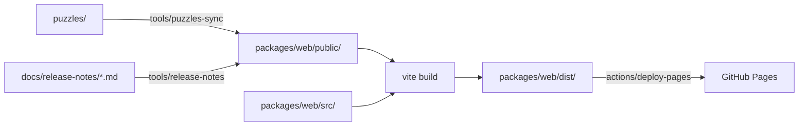

# 配信(GitHub Pages)

**ゲーム本体を GitHub Pages へ出す。** ドキュメントは出さない(2026-08-06 の決定)。

- 出す元は **`main` だけ**。`develop` は「動く状態」であって「出してよい状態」ではない
  ([ブランチ戦略](branch-strategy.md))
- 出す仕掛けは [`.github/workflows/pages.yml`](../../.github/workflows/pages.yml)
- リリースの手順は [`ops-release` スキル](../../.claude/skills/ops-release/SKILL.md)

## URL

```
https://lost-chapter.github.io/sudoku-web/
```

Organization の名前 + リポジトリ名。⚠️ **末尾のスラッシュまでが基準の位置**である。

## 1 度だけやること(GitHub 側の設定)

🔴 **ここはユーザーの操作である。** エージェントは行わない。

### 1. リポジトリを public にする

⚠️ **`lost-chapter` は Free プランなので、private のままでは Pages を使えない**
(2026-08-06 実測。`gh api repos/lost-chapter/sudoku-web/pages` が 404、
`gh api orgs/lost-chapter` の `plan.name` が `free`)。

**Settings → General → Danger Zone → Change repository visibility → Public**

⚠️ **コード・ドキュメント・コミット履歴がすべて公開される。**
出す前に、鍵や個人情報が履歴に入っていないことを確かめること。

```bash
gh secret list --repo lost-chapter/sudoku-web   # 2026-08-06 時点で 0 件
```

### 2. Pages の出どころを Actions にする

**Settings → Pages → Build and deployment → Source → GitHub Actions**

⚠️ **既定の「Deploy from a branch」のままでは workflow が効かない。**
ここを変えないと、`pages.yml` が成功しているのにサイトが更新されない。

### 3. 確かめる

```bash
gh api repos/lost-chapter/sudoku-web/pages --jq '{status, html_url, build_type}'
```

`build_type` が `workflow` になっていること。

## 出すとき

**`main` へ入ったら自動で出る。** 手で出したいときは次のとおり。

```bash
gh workflow run pages.yml --repo lost-chapter/sudoku-web
gh run watch --repo lost-chapter/sudoku-web
```

## 🔴 サブパスで壊れるもの

**Pages はリポジトリ名のサブパス(`/sudoku-web/`)に置かれる。**
`vite.config.ts` の `base` は **HTML が参照する資産(JS / CSS)しか直さない。**
**アプリの中で組み立てている URL は直らない。**

⚠️ **`pnpm preview` では見つからない。** あれはルートで配るので、
絶対パスの `fetch` がそのまま当たってしまう。

### 手元で再現する

```bash
pnpm build:pages
pnpm preview:subpath
```

`http://localhost:4321/sudoku-web/` を開いて遊ぶ。
**Ctrl-C で止めると、サブパスの外へ出た要求の一覧が出る。**
そこに並んだものが、本番で 404 になるものである。

### 2026-08-06 の実測

| 要求した URL | 結果 |
|-------------|------|
| `/sudoku-web/` | ✅ 200 |
| `/sudoku-web/assets/index-*.js` | ✅ 200(`base` が効いている) |
| **`/puzzles/manifest.json`** | 🔴 **404**(アプリが組み立てている URL) |
| `/sudoku-web/puzzles/manifest.json` | ✅ 200(本来当てるべき URL) |

**画面には「遊べる問題が見つかりません。読み込み直してください。」と出て、
難易度のボタンが 1 つも並ばず、1 問も遊べなかった。**

### 直し方

**アプリの中で組み立てる URL は `import.meta.env.BASE_URL` を起点にする。**

```ts
// ❌ サブパスで 404 になる
const DEFAULT_BASE_URL = "/puzzles";

// ✅ base が付く(手元では "/"、Pages では "/sudoku-web/")
const DEFAULT_BASE_URL = `${import.meta.env.BASE_URL}puzzles`;
```

⚠️ **`BASE_URL` は末尾がスラッシュである。** `/` を足すと `//puzzles` になる。

**該当するのは 3 つ。**

| 何 | 置き場所 |
|----|---------|
| 問題パック(`manifest.json` / `packs/*.txt`) | `packages/web/src/features/puzzle/loadPuzzle.ts` |
| リリースノート(`release-notes.json`) | 閲覧機能([リリースノートの形式](../api/release-notes-format.md)) |
| 🔴 **favicon** | `packages/web/index.html`(**`%BASE_URL%` で書く**) |

### ⚠️ ブラウザが勝手に要求するものもある(2026-08-06 に検出)

**`.ts` を全部直しても 1 件残った。**

```
🔴 本番で 404 になるものが 2 件ある
  /favicon.ico            ← 誰も書いていない
  /puzzles/manifest.json
```

⚠️ **指定が無いと、ブラウザは `/favicon.ico` をドメイン直下へ要求する。**
**コードを検索しても出てこない**ので、**`preview:subpath` で実際に配らないと見つからない。**

🎯 **`import.meta.env.BASE_URL` の検索では足りない。**
**「外へ出た要求」の一覧が空になることを見ること。**

**直し方**(`index.html` は `%BASE_URL%` が使える)。

```html
<link rel="icon" type="image/svg+xml" href="%BASE_URL%favicon.svg" />
```

## 配信物の作られ方



**`public/` の中身は Git 管理外である。** `pnpm build` が毎回作り直すので、
手で置いたものは消える。

## 気をつけること

| 何 | なぜ |
|----|------|
| ⚠️ **サイトは全世界から見える** | private リポジトリで Pages が使えるプランでも同じ。アクセス制御は Enterprise Cloud だけの機能である |
| ⚠️ **`404.html` を置いてある** | 画面ごとの URL を持たせたときに要る。いまは 1 画面なので効いていない |
| ⚠️ **反映まで数十秒かかる** | `deploy-pages` が終わってもすぐには変わらない。CDN の反映を待つ |
| ⚠️ **キャッシュが残る** | 直したのに変わらないときは、まず別のブラウザか私用ウィンドウで見る |

## 関連ドキュメント

- [ブランチ戦略](branch-strategy.md) — `main` に入るものの決め方
- [`ops-release` スキル](../../.claude/skills/ops-release/SKILL.md) — リリースの手順
- [リリースノートの形式](../api/release-notes-format.md) — 配信物のもう 1 つ
- [実装の進め方と現在地](implementation-roadmap.md) — 工程 5(本番構成)
