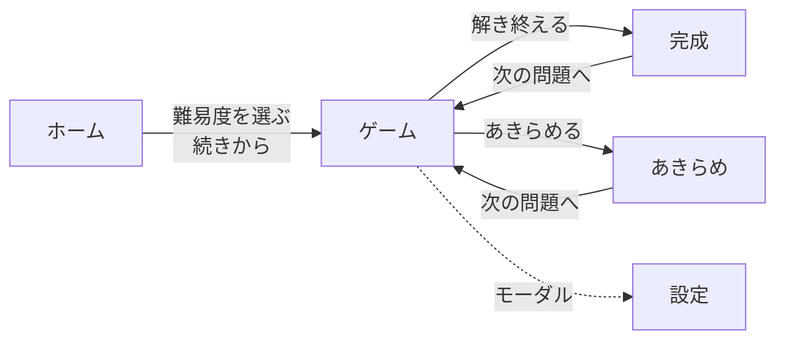
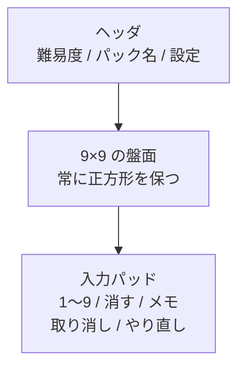

# 画面構成と操作仕様

**この文書は「何をどう振る舞わせるか」だけを扱う。** 見た目の実装はコード側の責務。

盤面(9×9 のグリッド・セル選択・候補の表示)は**自前で実装する**。
UI ライブラリに任せるのは盤面の外側である([ADR 0002](../decisions/0002-ui-library-selection.md))。

## 画面

| 画面 | 役割 |
|------|------|
| ホーム | 難易度を選ぶ。遊びかけがあれば「続きから」を出す。⚠️ **遊びかけを開くのは「続きから」を選んだときだけ**(2026-08-05 決定。起動時に必ず開くと、別の難易度で遊び始められない) |
| ゲーム | 盤面を遊ぶ。**アプリの本体で、ここに時間の大半を使う** |
| 設定 | テーマ・補助表示の切替。ゲーム画面からモーダルで開く |
| 完成 | 解き終わったときに出す。次の問題へ進む導線 |
| **あきらめ** | **解を見せて遊技を終える**。そこから次の問題へ進む |
| **更新情報** | **何が変わったかを読む**。⚠️ **ホーム画面から**モーダルで開く(下記) |

**画面遷移は最小に保つ。** ホーム → ゲーム → (完成 / あきらめ) → ゲーム、が主動線。



**完成からもあきらめからも、戻り先はゲームである。** 設定だけは画面ではなく、
ゲームの上へモーダルで重ねる。

## ゲーム画面の構成



- **盤面は常に正方形。** 画面の短辺に合わせて拡縮する
- **入力パッドは縦画面では盤面の下、横画面では横**に置く

⚠️ **スマートフォンは別のレイアウトを持つ**([ADR 0005](../decisions/0005-mobile-dedicated-layout.md))。
上の図はスマートフォン以外のもの。

### 🕐 経過時間は出さない(2026-08-06・発注者の要望)

**「タイマーとかスコア」は要らないという要望のため、削除した**
([ADR 0004](../decisions/0004-feature-scope-from-client.md))。
**表示だけでなく、計測も保存もしない**(`elapsedMs` を進行の保存から外した)。

⚠️ **この文書は経過時間の位置を 2 度往復させ、「これで確定。もう動かさない」と
書いていた**。**その位置ごと消えた**。「どこに置くか」を往復している間、
**「置くかどうか」を誰も問うていなかった**というのが、残すべき教訓である。

## 盤面の操作

### セルの選択

| 操作 | 動き |
|------|------|
| クリック / タップ | そのセルを選択する |
| 矢印キー | 選択を上下左右に移す。**端では止まる**(反対側へ回り込まない) |
| Tab | 盤面全体で 1 つのフォーカス対象とし、**81 個を Tab で辿らせない** |

**選択は常に 1 セル。** 複数選択は持たない。

### 数字の入力

| 操作 | 動き |
|------|------|
| `1`〜`9`(キーボード / テンキー / 画面のパッド) | 選択中のセルへ入力する |
| `0` / `Backspace` / `Delete` | 入力を消す |
| 同じ数字をもう一度 | **消す**(トグル) |
| 手がかりのセルへの入力 | **何も起きない**。エラーも出さない |

### メモ(候補)

| 操作 | 動き |
|------|------|
| `Space` または パッドの**メモのスイッチ** | メモモードを切り替える |
| メモモード中の `1`〜`9` | そのセルの候補を立てる / 落とす |
| そのセルへ数字を確定入力する | **メモは消える** |
| 確定入力を消す | **メモは戻らない**(取り消しで戻す) |
| **確定値が入っているセルへのメモ** | **何も起きない**(2026-08-05 決定)。確定値があるセルの候補は意味を持たない |

**候補は 3×3 に並べ、立っていない候補も場所を空けたままにする。**
詰めると、何が立っているかを数え直すことになる。

#### 🔴 メモの切り替えはスイッチにする(2026-08-06・発注者の要望)

**「メモ 切」というボタンは、状態にも命令にも読める。**
**「いま切です」なのか「押すと切ります」なのかが、文字を足しても定まらない。**

🎯 **状態を持つものは、状態を表す形にする。**

| 項目 | 決めたこと |
|------|-----------|
| 形 | **つまみが左右に動くスイッチ**。`role="switch"` + `aria-checked` |
| ⚠️ **要素** | 🔴 **`<button>` にする。`<input type="checkbox">` にしない** —— **入力欄にすると、そこにフォーカスがある間だけ数字キーが効かなくなる**(ホットキーが `INPUT` を避けるため) |
| 状態の伝え方 | **つまみの位置**(色だけに載せない)。読み上げは `aria-checked` |
| ⚠️ **つまみと溝の明暗差** | 🔴 **3:1 以上**(WCAG 1.4.11)。**位置で伝える設計なので、つまみが見えないと設計ごと効かない**。実測は**切 8.18 / 入 5.02** |
| 置き場所 | PC 版・スマホ版の**両方**。⚠️ **同じ迷いが両方で起きる** |

#### ⚠️ 上フリックでメモ(2026-08-06 の試作。採否は未定)

**スマホの数字キーを上へ 24px 以上はじくと、その 1 回だけ候補が立つ**
(モードは変わらない)。[検討の記録](../reports/2026-08-06-flick-input-survey.md)。

⚠️ **フリックは追加の経路であって、置き換えではない。**
**メモのスイッチは残してあり、キーボードだけで遊べることも変わらない。**

⚠️ **読み上げでは案内していない。**
**フリックはその経路を持たない人には使えない操作**なので、
**キーの名前に混ぜると「届かない案内」になる。**

🔴 **指の操作は全部こちらで振り分ける**(タップ / フリック / 取り消し)。
⚠️ **`click` に任せると、ブラウザが「滑った」と見なす範囲が丸ごと無反応になる**
(tap slop。実測でおよそ 15px)。**閾値を下げても穴の位置が動くだけである。**

### 取り消し・やり直し

| 操作 | 動き |
|------|------|
| `Ctrl/⌘ + Z` | 直前の操作を取り消す |
| `Ctrl/⌘ + Shift + Z` | やり直す |

**取り消しは操作単位。** メモの 1 つ立て・数字 1 つの入力がそれぞれ 1 手。
実装は `core` の reducer に積んだ action を辿る
([システム構成](../architecture/system-architecture.md) の「状態管理は reducer に寄せる」)。

## 補助表示

**すべて設定で切れること。** 既定は「控えめ」側に寄せる。

| 表示 | 既定 | 中身 |
|------|------|------|
| 同じ数字の強調 | **入** | 選択中のセルと同じ数字を目立たせる |
| 行・列・ブロックの強調 | **入** | 選択中のセルが属する 3 方向を薄く敷く |

**盤面は遊技者の入力をそのまま映す。** 正しいかどうかを盤面から読み取らせない。

### 🚫 間違いを教えない(2026-08-06・発注者の要望)

**「間違ってると教えてくる」「出し尽くした数字が候補から消える」は
要らないという要望のため、実装ごと削除した**([ADR 0004](../decisions/0004-feature-scope-from-client.md))。
**設定にも残さない。**

| 消したもの | 何をしていたか |
|-----------|--------------|
| 誤りの即時指摘 | 解と違う入力を破線の枠で示していた |
| **矛盾の表示** | 同じ行・列・ブロックの重複を波線で示していた |
| 残り数の表示 | 各数字の残りを出し、**0 になった数字をパッドで落としていた** |

⚠️ **矛盾の表示も消した**。規則の重複は「答え」ではなく「遊技者の入力の中の食い違い」だが、
**遊技者から見れば同じく「教えてくる」ものである**。線を引くと説明が要る。

⚠️ **読み上げのラベルからも「重複」「誤り」を外した。**
**画面に印を出さないのに読み上げだけ残すと、見える人と見えない人で分かることが変わる。**

⚠️ **`core` の `findConflicts` は残してある**。盤面ロジックとしては正しく、
**呼ばれなくなっただけ**である([解法(ソルバ)](../algorithms/solver.md) の `findHint` と同じ状態)。

## あきらめる

**行き詰まったら解を見て終われること**(2026-08-06・発注者の要望)。

| 項目 | 決めたこと |
|------|-----------|
| 何が起きるか | **解を盤面に出す**。遊技者の入力と見分けが付く見せ方にする |
| そのあと | **入力できない**(遊技が終わった状態)。「次の問題へ」に進める |
| 進行の保存 | **消す**。諦めた問題を「遊びかけ」として残すのはおかしい |
| ⚠️ 誤爆 | **押すと遊技が終わる**。確認を挟むか、置き場所で防ぐ |

**「あきらめる」は救済であって罰ではない。** 責める文言を出さない。

### 実装で決めたこと(2026-08-06)

| 項目 | 決めたこと |
|------|-----------|
| 置き場所 | **ヘッダの右**。親指の付け根から最も遠く、遊技中に触りにくい |
| 確認 | **モーダルで挟む**。既定のフォーカスは**「やめる」** に置く(Enter の連打で確定させない) |
| 自分で入れた正解 | **そのまま残す**。そこまでは自分で解いたので、全部を「答え」に見せるのは事実と違う |
| 間違えていたマス | **解で上書きする**。「最後に正解が分かる」が目的なので、誤答を残すと果たせない |
| 見分け方 | **細字 + セル右上の点**(手がかりは太字)。読み上げは「5 行 3 列、**答え** 7」 |
| 見た目 | ⚠️ **赤や警告色にしない**。救済であって失敗ではない |
| 取り消し | **できない**。終わった盤面なので履歴を辿る意味が無い |
| 選択の移動 | **できる**。読み上げで盤面を辿れる必要がある |

⚠️ **背景(網掛け)では区別しない**。背景を変えると、強調が重なるたびに文字の
コントラストが変わり、**測る組み合わせが倍になる**。点なら読みやすさに影響しない。
実測(幅 375px / 320px・地の上 / 同じ数字の強調の上 / 選択の上):
**ライト 6.28〜7.35 / ダーク 4.84〜6.54。**

### 🔴 「完成」と「あきらめ」を同じ判定で見ない(2026-08-06)

**あきらめると盤面は解と一致する**。そのため**完成の判定をそのまま使うと、
諦めた遊技者に「完成しました」と知らせてしまう。**

| 判定 | 意味 |
|------|------|
| **盤面が解と一致するか** | あきらめても真 |
| **遊技者が自分で解き終えたか** | あきらめたら偽。**完成の知らせはこちらで出す** |

⚠️ **実際に 1 度出した**。モーダルが 2 枚重なり、手前の「答えを表示しました」しか
見えなかったので、**目で見て確認する限り正しく見えた。**
**読み上げには「完成しました」が出ていた。**

🎯 **見えているものが正しいだけでは足りない。**
**状態が変わる操作を確かめるときは、`aria-live` の中身も一緒に見ること。**

## ホーム画面(2026-08-06・発注者の要望で作り直した)

**「難易度選択の画面がレベルが低く見える。もっとこだわってリッチに」**、という指摘を受けた。
⚠️ **主観で直さず、本番の画面を測って原因を挙げてから直した。**

| 何が起きていたか | 実測 | どうしたか |
|----------------|------|-----------|
| 🔴 **ボタンの幅が文字数で決まる** | **94 / 79 / 108 / 66 / 80px** で **3 + 2 に折り返す** | **縦に積んで幅を揃える** |
| 🔴 **5 段階に見た目の差が無い** | 全部同じボタン | **塗られたマスの数で段階を表す** |
| **画面の 2/3 が空白** | スマホ 440px 以降 / PC 220px 以降 | 表題を作り、カードを積む(⚠️ **後述の「スクロールさせない」と同じ方向**) |
| **表題がアプリの顔でない** | `h2` 相当・左上 | **`h1` + 盤面を模した印** |
| **持っている情報を出していない** | `totals` に各 1,000 問 | **「5 段階・全 5,000 問」と各カードの収録数** |
| **主従が無い** | 更新情報が難易度と同じ見た目 | **更新情報を小さくする** |

🎯 **難易度は順序のある情報である。** その順序が形に出ていないと、
**同じ見た目のボタンが並んでいるだけ**に見える。

### 🔴 スマホでは縦スクロールさせない(2026-08-06・発注者の追加の要望)

**ゲーム画面と同じ扱いにする。**⚠️ **PC 版は今までどおり縦に伸びてよい**(「スマホでは」の指定)。

🎯 **⇒ リッチさを「縦に足す」ことでは作れない。1 画面の中の密度と構成で作る。**

| 端末 | どうしたか |
|------|-----------|
| 縦向き | **1 列に積む**。カードの高さは 60px |
| 🔴 **横向き**(568×320) | **3 列に畳む。**⚠️ **積んだままだと 635px 要り、320px にはまったく入らない**(実測) |
| **遊びかけ** | 🔴 **難易度と同じ形のカードにして、リストの先頭へ置く。**⚠️ **専用の囲みを別に持つと、その高さぶんだけ入らない** |
| **「難易度を選ぶ」の見出し** | **画面からは外し、読み上げだけに残す**(`role="group"` の名前)。**カードを見れば分かるものに行を使わない** |

⚠️ **逃げ道(スクロールを許す高さ)は要らない。**
**ゲーム画面は「1 画面」と「セル 24px」が両立しない高さがあるので逃げ道を持つが、
ホームには 24px のような下限が無く、詰めれば必ず収まる。**
**実測でも 320×568(遊びかけあり)で収まっている。**

⚠️ **更新情報のモーダルの中は別である。**
**「ページが縦に流れる」ことと「モーダルの中で読み進める」ことは分けて考える。**

| 決めたこと | 中身 |
|-----------|------|
| **段階の表し方** | 🔴 **3×3 のマスのうち、段階の数だけ塗る**(1〜5)。⚠️ **色だけに載せない** —— **数えれば分かる** |
| **塗りの色** | ⚠️ **明るい側と暗い側で変える**。実測で**暗い側は塗りと空の差が 2.00** しか無く、**数える設計そのものが効かなかった**。直して**ライト 3.36 / ダーク 4.06** |
| **カード全体がボタン** | 押せる面積を最大にする。高さ **72px** |
| **表題の印** | **CSS だけで描く。**⚠️ **画像も Web フォントも増やさない** |
| ⚠️ **`h1` は 1 つ** | **外枠の表題はホーム画面では出さない**。両方出すと `h1` が 2 つ並ぶ |
| **主従** | **更新情報は小さく。**⚠️ **`subtle` は使わない**(白地で 3.4:1 と本文の目安を割る) |

## 🎨 見た目の詰め(2026-08-06・発注者の要望)

**「難易度選択画面・ゲーム画面ともにデザインをブラッシュアップ」**、という指摘を受けた。
⚠️ **主観で直さず、本番(0.2.0)を測って原因を挙げてから直した。**

| 何が起きていたか | 実測 | どうしたか |
|----------------|------|-----------|
| 🔴 **内部のファイル名が画面に出ている** | `packs/hard-000.txt` | **消す**。難易度の名前で足りる |
| 🔴 **PC で表題と盤面の軸がずれる** | **94px** | **ゲーム画面では器ごと盤面の上限(`--sudoku-board-max`)へ絞る** |
| **盤面の上に空白** | **213px**(画面の 26%) | **キーを画面の高さから決めて吸わせる**(下記) |
| **盤面が画面の端から 4px** | 4px | **12px。**⚠️ **OS の画面端ジェスチャとも重なっていた** |
| **ホーム画面の下が空く** | 約 300px | **カードが余りを分け合う**(上限 104px) |

### 🔴 余りは消せない。どこへ置くかを決める

**縦向きの盤面は幅で頭打ちになる**。375×812 では**一辺 351px** が上限で、
**高さは 181px 余る。**⚠️ **盤面を大きくして埋めることはできない。**

**⇒ キーの高さを画面の高さから決め、余りの一部を吸わせる。**

```css
--pad-key-height: clamp(48px, 11svh, 88px);
```

| 値 | 理由 |
|----|------|
| **下限 48px** | **狭い端末で盤面のセル 24px を守れる最大**(変えていない) |
| **上限 88px** | ⚠️ **無いと縦長の短冊になる**(実測で 1 つ 170px)。**数字のキーに見えなくなる** |

**残りは盤面の上に置く**(実測 213 → **109px**)。
🎯 **よく見るもの(盤面)とよく押すもの(パッド)を離さないため。**

⚠️ **横向きには当てない。** **あちらは高さで頭打ちになる**ので、
**幅だけの器にすると盤面が潰れる**(実測で一辺 6px になった)。

### 🔴 最小値を 0 にすると、押せる下限まで無くなる

**パッドの列を `minmax(0, 1fr)` にした**(中身に押し広げられないようにするため)。
🔴 **その結果、横向きの「消す」が 44px を割った。**

⚠️ **中身に押されないようにしたら、押せる下限も一緒に消えた。**
**⇒ 最小値は 0 ではなく、押せる下限そのものにする**(`minmax(44px, 1fr)`)。

🎯 **硬化のつもりの変更が、別の壊れ方を作ることがある。**
**E2E が拾ったので気づけた。**

### ⚠️ 横向きの盤面は端から 4px のまま

**縦向きは 12px にしたが、横向きは変えない。**
⚠️ **実測: 12px にすると一辺 304 → 274px、1 セルが 33.2 → 29.7px。**
**横向きは盤面の取り分がいちばん厳しいので、ここは削らない。**

⚠️ **画面端の OS ジェスチャとは重なったままである。**
**⇒ それでも困らないのは、盤面を掴むスワイプ操作を持っていないからである**
([フリックの検討](../reports/2026-08-06-flick-input-survey.md) で B・D 案を落とした)。
🔴 **盤面にスワイプを足すなら、ここを先に見直すこと。**

### ⚠️ 幅を詰めたら、中身が消えた

**PC 版を盤面の幅(512px)へ揃えたところ、数字のキーが 9 列で 1 つ 54px になった。**
🔴 **`size="lg"` の左右の余白(22px × 2)だけで幅を食い尽くし、数字が 0 幅に潰れた。**

⚠️ **`aria-label` は残るので、E2E は通る**。目視でしか見つからない。
**⇒ 幅を詰める変更をしたら、中身が入っているかを目で見る。**

## 更新情報(2026-08-06)

**何が変わったかを読めるようにする。** 形式は [リリースノートの形式](../api/release-notes-format.md) が正本。

| 項目 | 決めたこと |
|------|-----------|
| **置き場所** | 🔴 **ホーム画面**。⚠️ **遊技中に押してほしくないものの置き場所は「あきらめる」と同じ考え方で決める** |
| **設定に入れない** | 設定は**遊び方を変えるところ**で、性質が違う。読み物を混ぜない |
| **しるし** | 🎯 **文字で出す**(「更新情報(新着)」)。⚠️ **色や点だけに載せない** |
| **開いたら既読** | 最新の版を記録する。**版ごとには覚えない**(上から順に読むものなので) |
| **初回は既読** | ⚠️ **初めて遊ぶ人に過去の変更点を知らせても意味が無い**。しるしが最初から付いていると**「新しい知らせ」の意味が薄れる** |
| **取れなかったら** | ⚠️ **入口ごと出さない**。押しても何も出ないボタンは、**壊れているのか中身が無いのかが分からない** |
| **収まらないとき** | **素直にスクロールさせる**。読み物なので 1 画面に収める価値が低い |

### 🔴 「開く」と「既読にする」は同じ 1 回の操作で起きる

**しるしが消えるのに開かない、という壊れ方がある。**

⚠️ **2026-08-06 に、手元の検証で 1 度これを見た。**
**原因は検証のしかたで、実装ではなかった** ——
**JS から `element.click()` を呼ぶと `mousedown` が出ない**ため、
**モーダルが開いた直後に「外側が押された」と判定されて閉じていた。**

🎯 **合成した `click` は、人の操作を代表していない。**
**実ブラウザの本物のクリックで確かめること**(E2E に 1 件置いてある)。

## アクセシビリティ

- **盤面は `role="grid"`、セルは `role="gridcell"`** とし、
  選択中のセルに `aria-selected` を付ける
- **セルには「位置と中身」が分かるラベルを付ける**(例: 5 行 3 列、空、候補 1 2 7)
- **色だけに情報を載せない。** 手がかり・入力済み・**あきらめて出した解**は、
  色に加えて太さ・記号・背景の濃さでも区別できること
- **キーボードだけで最初から最後まで遊べること。** マウスが要る操作を作らない
- コントラスト比は本文 4.5:1 以上を目安にする

### コントラストの測り方(2026-08-05 に追記)

**地の上だけで測ると足りて見える。** 実際に 8 回踏んだので、測り方を決めておく。

- **その文字が乗りうる最も明るい / 暗い背景の上で測る。**
  盤面のセルは選択・同じ数字の強調・行列ブロックの強調が重なるので、
  **重なった状態を作ってから測る**(例: 入力した数字を選ぶと、
  そのセルは強調でも選択中でもある)
- **盤面の文字は幅で大きさが変わるので、最も小さくなる幅(375px)で測る。**
  広い幅ではセルが大きく、数字が「大きい文字」(24px 以上、または 18.66px 以上の太字)に
  当たって基準が 3:1 に緩む。**狭い幅の失格を見落とす**
- **無効の判定は祖先まで見る**(`closest("[disabled], :disabled")`)。
  ボタンの中のラベルは自分自身に `disabled` を持たないので、
  要素だけを見ると**無効なボタンの中身を「有効で失格」と誤判定する**
- **無効な部品は対象外。** WCAG が除外しているうえ、
  押せないことが見て分かる必要もあるので濃くしない
- ⚠️ **`color-mix()` の値は `color(srgb 0.71 0.15 0.15)` 形式で返る。**
  `rgb()` と同じに 0〜255 として読むと**真っ黒として測ってしまう**。
  0〜1 のスケールとして扱うこと。**2026-08-05 に 2 人が別々に踏んだ**
- ⚠️ **半透明の背景は、祖先と合成してから測る。**
  `getComputedStyle().backgroundColor` は `rgba(46, 160, 67, 0.09)` を**そのまま返す**。
  alpha を捨てて `rgb(46, 160, 67)` として読むと、**淡い網掛けを濃いべた塗りとして測る**。
  **2026-08-06 に `docs-html` の表で踏んだ**(`✅` のセルの淡い緑)。

  | 読み方 | 背景 | 比 |
  |-------|------|-----|
  | alpha を捨てる | `rgb(46,160,67)` | **4.68** ← 嘘 |
  | 祖先と合成する | `rgb(236,246,238)` | **14.4** |

  ⚠️ **上の色から順に下へ重ねる**。不透明な背景に当たるまで祖先を辿ること。
- ⚠️ **その文字が実際に乗る背景で測る。**「地の色」で代表させない。
  **2026-08-06 に `docs-html` のコードで踏んだ。** highlight.js の既定の灰色は
  **白の上で 4.55** だが、コードが乗る `--surface`(#f6f8fa)では **4.27** で失格だった。
- ⚠️ **ライブラリの既定色をそのまま使わない。**
  **その色は、そのライブラリの前提で選ばれている**。同じことが 3 回起きている。

  | 使ったもの | 実測 | いつ |
  |-----------|------|------|
  | Mantine の `dimmed` を本文に使う | **4.04**(地の上) | 2026-08-05 |
  | Mantine の `primaryShade` 既定(6 段目)+ 白文字 | **3.56**(ライト) | 2026-08-05 |
  | highlight.js の既定の灰色をコードに使う | **4.27**(`--surface` の上) | 2026-08-06 |

- 🔴 **測った値が、いま画面に出ている値とは限らない。**
  **`primaryShade` を直すとき、CSS 変数(`--mantine-primary-color-filled`)を
  上書きしても効かなかった。** Mantine の `Button` は**描画時に色を解決して
  `--button-bg` を要素へ直接書く**ため、変数を後から変えても要素の値は変わらない。
  ⚠️ **それでも測ると「直った値」が出る**(描画時の値が残っているため)。
  **2026-08-05 に、これで「5.02 になった」と誤って報告した。**
  **テーマを切り替えて描き直すと 3.56 のままだった。**
  ⇒ **色を直したら、描き直させてから測る**(テーマの切替・再読み込み)。
  **直した場所がテーマなのか、変数なのか、要素なのかを確かめること**
- 🎯 **「良すぎる値」を疑う。** 上の穴に気づけたのは、どちらも
  **地の上の黒文字(21.0)と並ぶ値が出たのはおかしい**と考えたからである。
  **測定器は落ちずに嘘の値を返す**。値の妥当性を自分で問う以外に気づく方法が無い
- 🎯 **数を報告するときは「何を数えたか」を書く。**
  **要素の数**(同じ色が 3 か所なら 3)と**色の種類の数**(1)では、
  **受け取る側が直す場所を 3 か所と読むか 1 か所と読むかが変わる**。
  **2026-08-06 に、この食い違いで 1 往復した**

## 端末ごとの作り

⚠️ **スマートフォンは幅で伸縮させるのではなく、専用のレイアウトを持つ**
(2026-08-06・[ADR 0005](../decisions/0005-mobile-dedicated-layout.md))。

| 端末 | 配置 |
|------|------|
| **スマートフォン(縦)** | ヘッダ → 盤面 → **下端に固定した入力パッド**。**スクロールしない 1 画面** |
| **スマートフォン(横)** | **盤面を左・パッドを右**。ヘッダはパッドの上に畳む |
| タブレット横・PC | 盤面を上、入力パッドを下(中央寄せ) |

### 🔴 スマホはどの画面もスクロールしない(2026-08-06 に発注者から追加)

**「スクロールしない 1 画面」はゲーム画面だけの要件だったが、ホーム画面にも広げた。**

| 対象 | 縦スクロール |
|------|------------|
| **スマホ版のホーム画面** | 🔴 **させない**(2026-08-06 に追加) |
| **スマホ版のゲーム画面** | させない(元から) |
| **PC 版** | **させてよい**。「スマホでは」という指定である |
| **更新情報のモーダルの中** | **させる。** ⚠️ **12 項目あるので、させないと読めない** |

⚠️ **「ページが縦に流れる」ことと「モーダルの中で読み進める」ことは別として扱う。**

🎯 **この制約は「余白が多い」という指摘と同じ方向を向いている。**
**⇒ 作り込みを「縦に足す」ことでやらない。1 画面の中の密度と構成でやる。**
**⇒ 何を出して何を出さないかを選ぶことになる。**

### 判定(2026-08-06 実装)

```
狭い画面向け = (pointer: coarse) かつ ((max-width: 767px) または (max-height: 500px))
横に並べる   = 上に加えて (orientation: landscape)
```

⚠️ **UA では分けない**。UA は偽装も変更もされ、**iPadOS は既定で Mac を名乗る**。
「いま触っている入力装置」と「いま使える大きさ」なら偽装する動機が無い。

⚠️ **高さも見る**。横向きのスマホは幅が 767 を超える(実測: iPhone X 級の横は 812×375)。
**幅だけで見ると PC 版へ落ち、縦積みのまま高さ 375px に入らず 532px はみ出す**(実測)。

**外したときに起きることは「見た目が好みでない」に留まる。**
スマホに PC 版が出れば縦に長い画面、PC にスマホ版が出れば大きなボタンが下に付くだけで、
**どちらも単独で遊技が成立する。**

⚠️ **条件式の正本は `packages/web/src/app/layout.ts` の 1 か所。**
`index.html` に先読みのスクリプトは置かない —— 条件が 2 か所になり、
**片方だけ直して食い違う**のがこの手の仕組みで最も多い壊れ方である。
初回描画から正しい側を出すのは `getInitialValueInEffect: false` で足りる。

### 余った高さは盤面の上へ寄せる(2026-08-06)

⚠️ **盤面は幅で頭打ちになるので、縦向きでは高さが必ず余る**(375×812 で **231px**)。
**盤面を大きくして埋めることはできない。**

**⇒ 余りは盤面の上に 1 か所でまとめ、盤面をパッドの直上へ置く。**

| 配り方 | 何が起きるか |
|--------|------------|
| 上へ 1 か所(**採用**) | **目線(盤面)と指(パッド)がいちばん近い**。空白が散らない |
| 上下へ均等(以前) | 空白が 2 か所へ割れ、**盤面とパッドの間が 115px 開く** |
| 下へ 1 か所 | **最も離れる**。盤面が上端に張り付く |
| パッドを大きくして埋める | **盤面が主役でなくなる**(採らない) |

⚠️ **横向きは中央のまま。** 盤面は高さで頭打ちになるので余りが出ず、
**パッドは右にあるので下へ寄せても指へ近づかない。**

### 寸法(2026-08-06 実測)

| 端末 | 盤面の一辺 | **1 セル** | パッドのキー |
|------|-----------|-----------|------------|
| 375×812(iPhone X 級・縦) | 367 | **40.1px** | 68 × 48 |
| 320×568(iPhone SE 級・縦) | 278 | **30.2px** | 54 × 48 |
| 568×320(横) | 304 | **33.2px** | 3 列 × 48 |

⚠️ **320px 幅ではヘッダが 2 行に折り返す**ので、盤面の取り分がその分だけ減る
(ヘッダを 44px にした 2026-08-06 に 312 → 278)。**24px の下限は保っている。**

⚠️ **キーの高さ 48px は「44px を守れる最小」ではなく「24px を守れる最大」である。**
大きくすると盤面の取り分が減り、狭い端末で 1 セルが 24px を割る。**安易に上げない。**

### 高さが足りない端末(2026-08-06 決定)

**高さ 442px を下回ると「スクロールしない」と「1 セル 24px 以上」が両立しない。**

| 高さ | 見せ方 |
|------|--------|
| 442px 以上 | **1 画面に収める**(スクロールなし) |
| 442px 未満 | **盤面の領域だけスクロールさせ、パッドは下に固定したまま** |

**盤面が読めなければ遊べない**ので、**24px を守る側**を選んだ。
⚠️ **これはユーザーの明示要件(スクロールしない)を条件付きで割っている。**
全部を一緒にスクロールさせないのは、**数字を入れるたびにパッドを探すことになる**ため。

⚠️ **実機の iOS Safari のバーの高さは測れていない**。上の判断は
Playwright の端末定義(バーを引いたあとの表示領域)を根拠にした推定を含む。
**実機で測れる人が測り直せるよう、推定であることを明示しておく。**

### 押せる大きさ(2026-08-05 に改訂)

⚠️ **盤面のセルに 44px は要求しない。9×9 では原理的に満たせないため。**

44px × 9 列 + 外枠で **402px** が要り、**幅 375px の端末(iPhone 相当)では入らない**。
余白を全部詰めても上限は約 41px である(実測)。
横スクロールさせるかセルを重ねるしかなく、どちらも遊技が壊れる。

| 対象 | 基準 |
|------|------|
| **盤面のセル** | **24px 四方以上を必ず満たす**(WCAG 2.2 のターゲットサイズ 最小)。そのうえで**画面の短辺を 9 等分して可能な限り大きく**する。スマホ版の実測は 375px 幅で **40.1px**、320px 幅で **30.2px** |
| **スマホ版の、盤面以外の押せるもの** | **44px 四方以上。例外を作らない。** 入力パッド・ホーム画面のボタン・ヘッダのボタンを含む。**大きさを自由に取れるものに、下げる理由が無い**(実測は 375px 幅で入力パッドが 68 × 48px、ホームの難易度が 94 × 44px) |
| **PC 版の、盤面以外の押せるもの** | **24px 四方以上を必ず満たす。** そのうえで**使う頻度に応じて大きさを変えてよい**(実測は「取り消し」「やり直し」が 36px、「難易度を選び直す」が 30px) |

⚠️ **2 段目を「入力パッドのボタン」と書いていたせいで、
ホーム画面の難易度ボタンが 36px のまま残っていた**(2026-08-06 に管理役が発見)。
🎯 **どちらにも当てはまらない対象ができる書き方をしない。**

### 🔴 PC 版を分けた経緯(2026-08-06)

**同じ穴がもう 1 度空いていた。** 上の表は 2026-08-05 の改訂で
**「それ以外の押せるもの → 44px。例外を作らない」** と書いてあったが、
**PC 版の 3 つ(36px / 36px / 30px)がそれを割ったままだった。**

⚠️ **アイコン化で入ったものではない。** `8203cbb` の時点で既に `size="sm"` である。
🔴 **E2E が phone の 4 通りしか回していないので、誰も測っていなかった。**

**裁定は「実装を直す」ではなく「文書を直す」にした。** 理由は 2 つ。

| 理由 | 中身 |
|------|------|
| **意図的な設計だった** | 「取り消し・やり直しは数字より使う頻度が低いので小さくする」と実装のコメントにある |
| **指とマウスで要る大きさが違う** | 44px は指の接触面が根拠である。**マウスに同じ根拠は無い**(WCAG 2.5.8 は 24px) |

⚠️ **ただし「PC は自由」とは書かない。** それをやると**また測られない対象ができる。**
**24px という下限を必ず置き、PC 版も E2E で走査する。**

**なぜ測られていなかったか。** `layout.e2e.ts` に 2 つの検査が同居していた。

| 検査 | PC 版に要るか |
|------|-------------|
| **1 画面に収まるか**(盤面のセル 24px) | **要らない**。PC 版は縦に伸びてよい |
| **押せるものの大きさ** | 🔴 **要る。下限が違うだけである** |

**`playwright.config.ts` の `desktop` は `keyboard.e2e.ts` しか回していない**ため、
**要らないほうと一緒に、要るほうまで落ちていた。**

🎯 **「この検査は PC に要らない」と判断したときは、
ファイル単位ではなく検査単位で確かめる。** 同居していると巻き添えになる。

🎯 **教訓は 2026-08-05 と同じで、守れていなかったのは書き方ではなく測り方だった。**
**「どちらにも当てはまらない対象を作らない」書き方にしても、
その対象を測る仕掛けが無ければ食い違いは残る。**

### 記号(アイコン)の使い方(2026-08-06 に追加)

**記号は文字に添える。文字を消すのは、代わりが利かないほど狭いところだけ。**
記号そのものの選定と調達は [ADR 0006](../decisions/0006-own-svg-icons.md)。

| 場所 | 記号だけか | 理由 |
|------|-----------|------|
| ヘッダの「ホーム」「設定」 | **記号だけ** | 幅がいちばん厳しい。**名前は `aria-label` が持つ** |
| 🔴 ヘッダの「あきらめる」 | **文字を残す** | **押すと遊技が終わる**。記号だけだと**「押して確かめる」が起きうる** |
| スマホの入力パッド | **記号だけ** | 5 列に並べるので文字が入らない |
| ⚠️ パッドの「メモ」 | **文字を残す**(入 / 切) | **状態を持つ**。記号だけだと**色でしか状態が分からない** |
| PC 版・ホーム・設定 | 文字を残す | **幅に余裕がある。落とす理由が無い** |

⚠️ **`aria-label` と見えている文字を食い違わせない**(WCAG 2.5.3 Label in Name)。
**見えている文字は、必ず読み上げの名前に含める。**

⚠️ **この 2 つは E2E で固定してある**(`packages/web/e2e/layout.e2e.ts`)。
**実ブラウザでしか測れない**ので、単体テストでは守れない。
⚠️ **1 つを選んで測らない。** **画面上のボタンを全部走査する**——
代表を 1 つ測る形だと、**測っていないものが下限を割っていても気づけない。**

⚠️ **ヘッダを 44px にすると、320px 幅では見出しが 2 行になり盤面が縮む**
(1 セル 34.0 → **30.2px**。24px は保つ)。
**押せる大きさを優先した。** 盤面は読めればよく、押せないボタンは押せない。

**「なるべく大きく」は要件にならないので、下限を 2 段で持つ。**

- 拡大表示(ブラウザのズーム)で崩れないこと

## 難易度の選択

**選べる難易度は `manifest.json` の `totals` から作る。画面にクラスを固定で書かない**
(2026-08-05 決定)。

| 状態 | 見せ方 |
|------|--------|
| `totals` が 1 以上 | 選べる |
| `totals` が 0、または `totals` に無い | **出さない**(または選べない状態にする) |

**理由**: クラスの供給は生成器の実装の進み方で変わる
([ロードマップの「難易度クラスの供給」](../guides/implementation-roadmap.md#難易度クラスの供給2026-08-05-決着))。
固定で書くと、**手筋が増えるたびに UI を直すことになる**。

⚠️ **2026-08-05 時点で「難問」「最難関」は 0 件である。**
表示名とファイル上の値の対応は [難易度の評価](../algorithms/difficulty-rating.md#難易度クラス)。

## テーマ

- ライト / ダークの両方を持ち、**既定は端末の設定に従う**(`prefers-color-scheme`)
- 設定で明示的に固定できる。選択は `localStorage` に残す

## 関連ドキュメント

- [ADR 0002 UI ライブラリの選定](../decisions/0002-ui-library-selection.md)
- [システム構成](../architecture/system-architecture.md) — 状態管理と進行の保存
- [難易度の評価](../algorithms/difficulty-rating.md) — 難易度の呼び名はここに合わせる
